# Getting Started - Setting up your development environment

Welcome to the workshop 'Creating Simple Fiori elements apps with OData V4'.\
This workshop will guide you step-by-step through the process of creating a Fiori elements floorplans for OData V4 app.\
Based on a SAP Cloud Application Programming Model service equipped with basic UI annotations, you will learn how to generate and enhance a\
List Report Object Page Fiori elements application with the help of Fiori Tools and CDS annotation modelling.

## Access SAP Business Application Studio (TechEd 2020 live workshop registered participants only)

Log on the SAP Business Application Studio via [this link](https://sap-ux-teched.cry10cf.int.applicationstudio.cloud.sap/index.html) by using the provided live workshop credentials.\
You can continue with the step [Create Dev Space](#create-dev-space).

## Set up Business Application Studio in an SAP Cloud Platform Trial Account

If you don't have an SAP Cloud Platform account already, you can create your own [here](https://www.sap.com/products/cloud-platform/get-started.html).

### New Trial Users

After having registered your new user, start your trial via [this link](https://account.hanatrial.ondemand.com/register)\
At first time log in, you'll be asked to select your preferred region.
This will start the set up of your account.


Your subaccount, org and space is created automatically, along with the necessary role configurations and subscriptions.\
When done, the subaccount overview page is shown.

### Existing Trial Users

In your subaccount, choose 'Subscriptions' in the left-hand navigation.\
Choose 'SAP Business Application Studio' in the list of available subscriptions.\
Choose 'Subscribe'.\
Navigate back to your subaccount overview page.

### Access SAP Business Application Studio

Click on the Quick Tool Access icon **SAP Business Application Studio**.

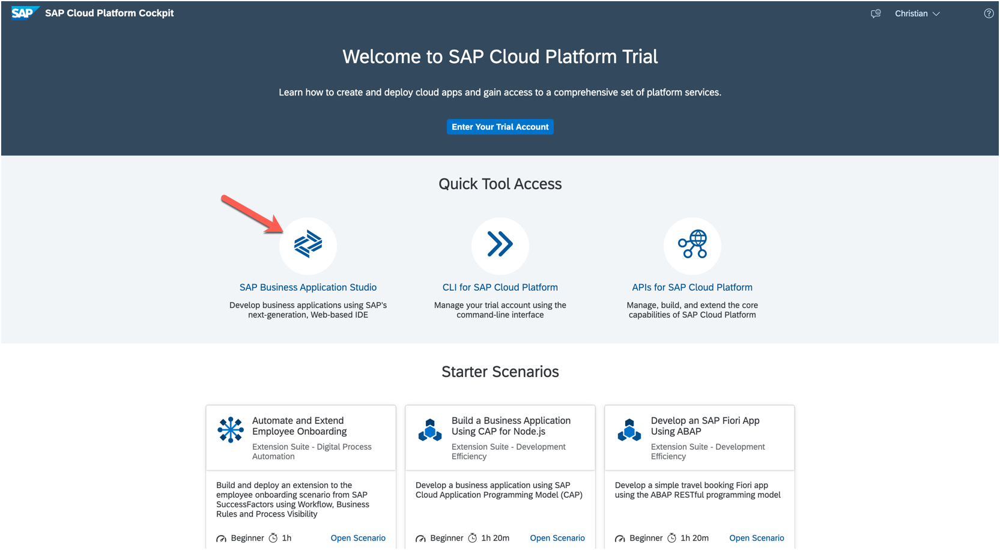

## Create development space

Click on the button **Create Dev Space**.

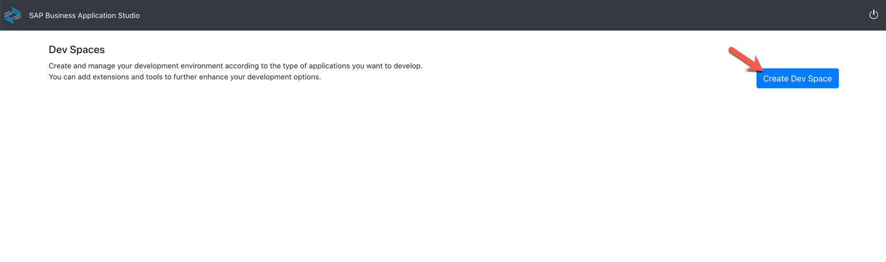

Enter a name for your development space and select application profile **SAP Cloud Business Application**.

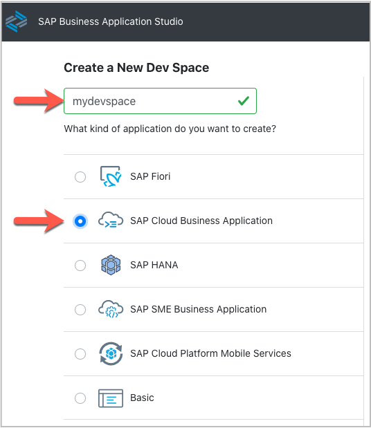

In the lower right corner of the page press button **Create Dev Space**.

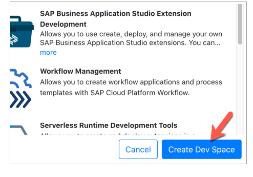<br>

Once your development space has status running, click on the development space name to open it.

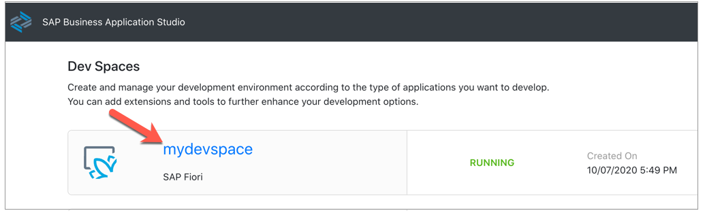

## Get the sample scenario

Get the GitHub repository clone Url from the repositories [root page](https://github.com/SAP-samples/teched2020-IIS360).\
Click on button **Code** (1), then click icon (2).

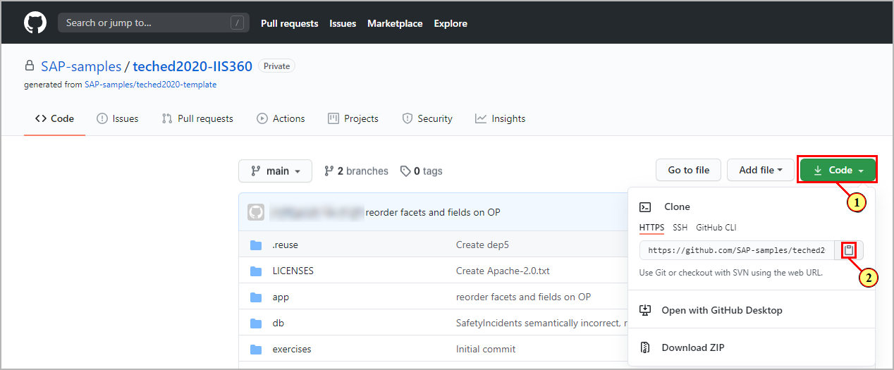

In the dev space, you will see a **Welcome Page**.\
Click on the link **Clone from Git**.

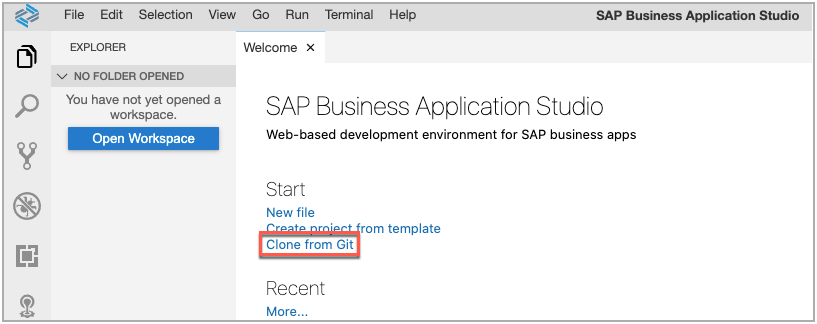

Alternatively, you can go via menu **View->Find Command...** and search for command **git clone**.

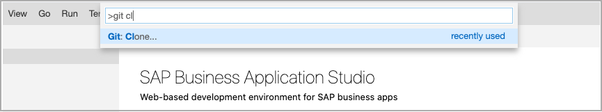

Paste the repository link into the input field.

```abap
https://github.com/SAP-samples/teched2020-IIS360.git
```

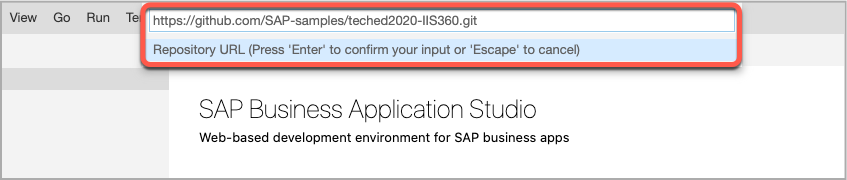

When the cloning is finished, open a workspace by clicking the button in the project explorer

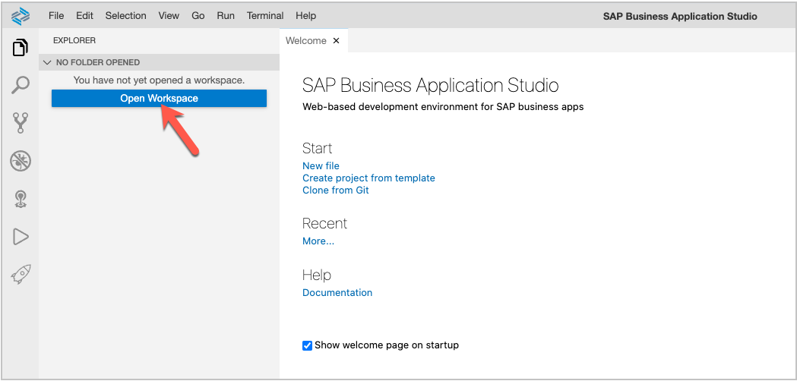

Select folder **teched2020-IIS360** and click **Open**.

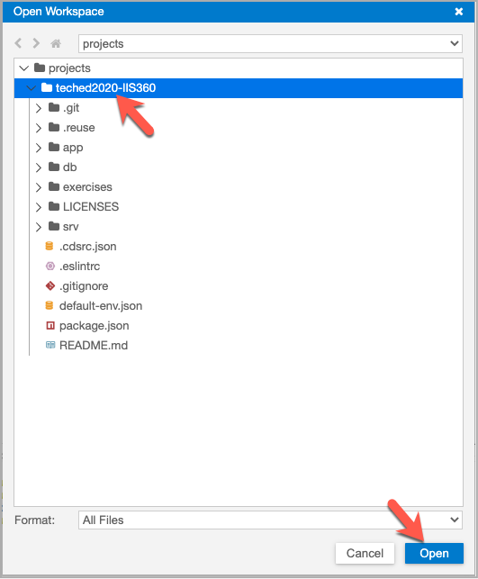

(3) Open a new terminal via the header menu.

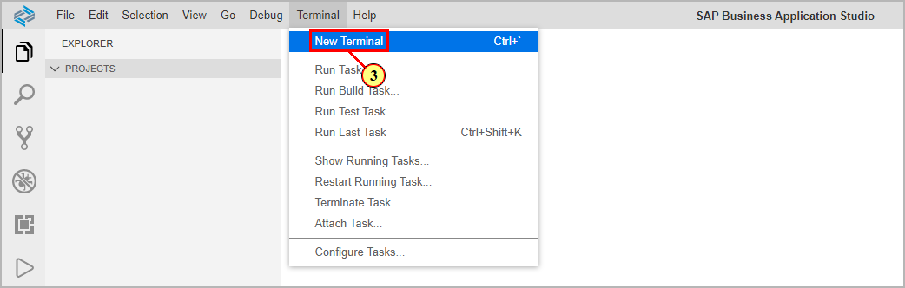

In the terminal window, make sure that the command line prompt shows folder **teched2020-IIS360**.

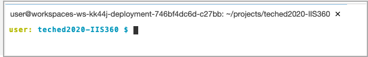

Type the following commands and confirm with return:

- npm install (this installs all node modules as defined in the projects package.json)
- cds w (this compiles the service and runs it in watch mode)

(4) Click button **Expose and Open** on the appearing dialog

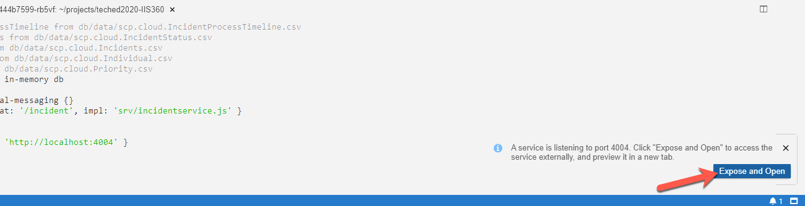

You can now provide an alias for the exposed port.\
(5)Enter 'preview' in the input field. Confirm with 'Enter'.

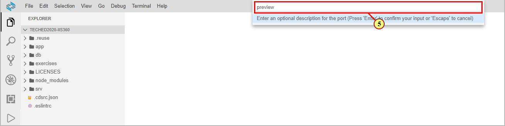

A browser is opened.\
(6) Click the **$metadata** link

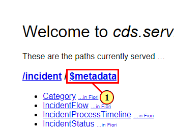

## Reopen the exposed port

If you closed the preview browser tab, you can reopen it by applying the following steps.

(7) Click **View -> Find Command...**.

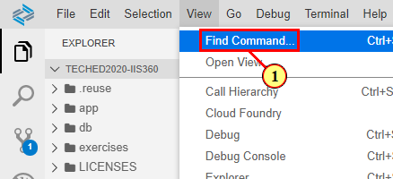

(8) Enter **port** in the dialogs input field to filter the available commands.


(9) Select  .

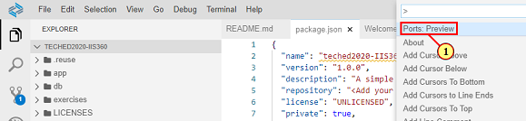

(10) A list with exposed ports is shown. Selecting one opens up a new browser tab.

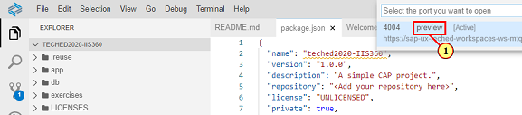

## Summary

With the setup procedure done, you now have completed:
- setting up the SAP Cloud Platform trial account
- Access to SAP Business Application Studio (SBAS)
- Creation of your development space
- Setting up the sample OData V4 service in SBAS

Continue to - [Exercise 1 - Generation of the Fiori elements app](../ex1/README.md)
