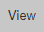
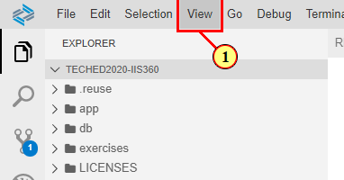

# Getting Started - Setting up your development environment

Welcome to the workshop 'Creating Simple Fiori elements apps with OData V4'.
 This workshop will guide you step-by-step through the process of creating a Fiori elements floorplans for OData V4 app.
 Based on a CAP OData service equipped with basic UI annotations, you will learn how to generate and enhance a List Report/Object Page Fiori elements application with the help of Fiori Tools and CDS annotation modelling. 

## Access SAP Business Application Studio (TechEd 2020 live workshop registered participants only)

Log on the SAP Business Application Studio via [this link](https://sap-ux-teched.cry10cf.int.applicationstudio.cloud.sap/index.html) by using the provided live workshop credentials. You can continue with step 'Create Dev Space'. 

## Set up Business Application Studio in an SAP Cloud Platform Trial Account

If you don't have an SAP Cloud Platform account already, you can create your own [here](https://www.sap.com/products/cloud-platform/get-started.html). 

### New Trial Users

After having registered your new user, start your trial via [this link](https://account.hanatrial.ondemand.com/register)
 At first time log in, you'll be asked to select your preferred region.
 This will start the set up of your account. 
  
 Your subaccount, org and space is created automatically, along with the necessary role configurations and subscriptions.
 When done, the subaccount overview page is shown. 

### Existing Trial Users

In your subaccount, choose 'Subscriptions' in the left-hand navigation.
 Choose 'SAP Business Application Studio' in the list of available subscriptions.
 Choose 'Subscribe'.
 Navigate back to your subaccount overview page.

### Access SAP Business Application Studio

Click this tool icon to access the SAP Business Application Studio 
  

## Create Dev Space

 1. Click here to create your dev space. 
  

 2. Enter a name for your dev space and select profile 'SAP Fiori' 
  

 3. In the lower right corner press button 'Create Dev Space' 
  

 4. Once your dev space has status running, click on the dev space name to access it 
  

## Get the sample scenario

 1. Access the Github Repository via [this link](https://github.com/SAP-samples/teched2020-IIS360)
 2. Click button code, then click here (1) to copy the git clone link 

 3. Open a new terminal via the header menu (1)
  
 4. In the terminal window, type the following commands and confirm with return:
 4a. cd projects
 4b. git clone https://github.com/SAP-samples/teched2020-IIS360.git (you can paste the copied link here)
 4c. cd teched2020-IIS360
 4d. npm install (this installs all node modules as defined in the projects package.json)
 4e. cds w (this compiles the service and runs it in watch mode) 
 5. Click button 'Expose and Open(1) on the appearing dialog 

 6. You can now provide an alias for the exposed port.
 Enter 'preview' in the input field (1). Confirm with 'Enter'.

 7. A browser is opened. Click the $metadata link (1)

 

## Reopen the exposed port

If you closed the preview browser tab, you can reopen it by applying the following steps.

(1) Click  .

(1) Click  .

(1) Click  .

 

(1) Click  .

 

## Summary

With the setup procedure done, you now have completed:
 - setting up the SAP Cloud Platform trial account
 - Access to SAP Business Application Studio (SBAS)
 - Creation of your dev space
 - Setting up the sample OData V4 service in SBAS 
 Continue to - [Exercise 1 - Generation of the Fiori elements app](../ex1/README.md)
