# Exercise 2 - Switch to Flexible Column Layout

In this exercise, we will switch the page layout to flexible column layout by making usage of the SAP Fiori Tool Page Map.\
Flexible column layout splits the screen into several areas, allowing faster navigation between the List Report line items.

(1) In BAS Explorer view, right-clicking on 
opens a shortcut menu.\
Alternatively, choose **Application Modeller - Show Page Map** via Command Palette.

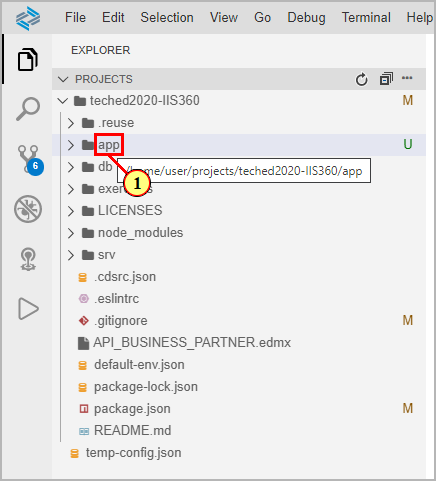

(2) Click .

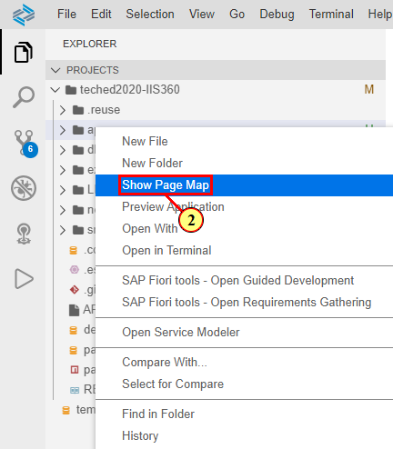

(3) The Page Map is opened in a separate tab, showing pages and navigations.\
In the top toolbar of the Page Map, click the page details icon  to the right.\
This opens up panel **Global Page Settings**.

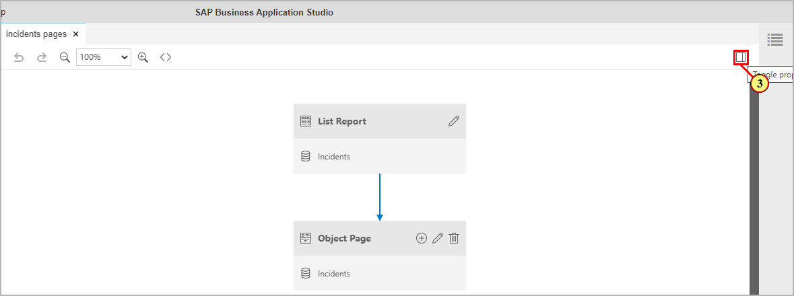

(4) Click radio button  for **Flexible Column Layout**.

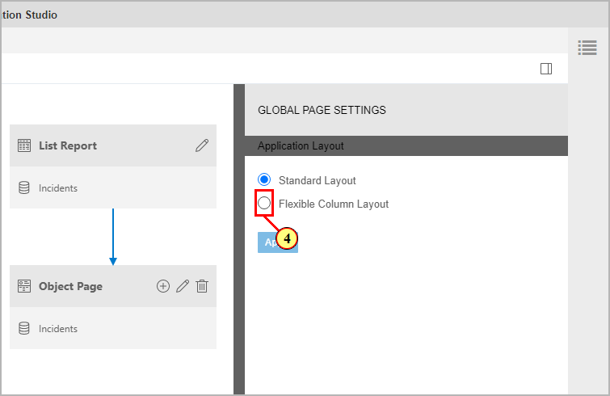

(5) Option **Select Layout for 2 Columns**: select **Mid-Expanded**\
Option **Select Layout for 3 Columns**: select **Mid-Expanded**

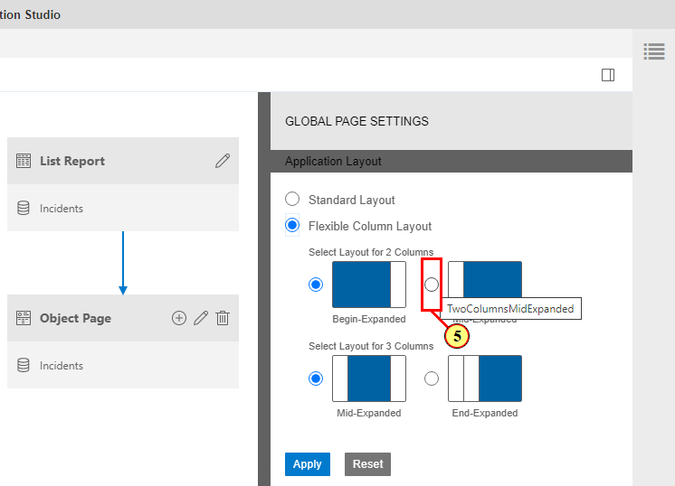

(6) Click .

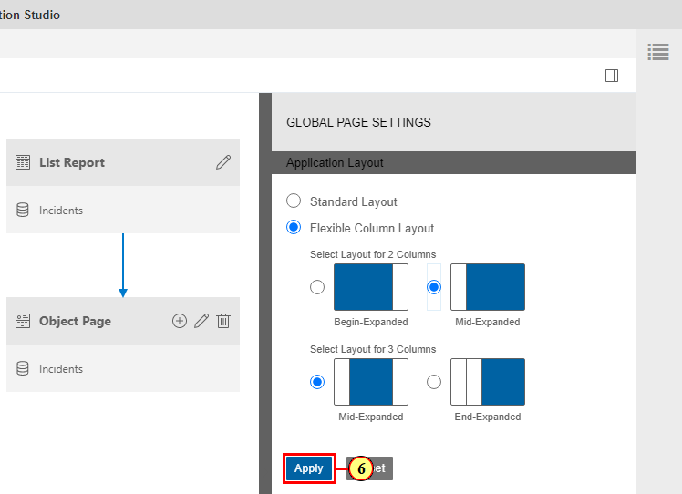

(7) Switch to the preview browser tab. If the app is still open from the previous exercise, navigate back to the Fiori Launch Page and refresh the browser.\
Now start the app again by clicking the launchpage icon. In the List Report, select a line item to open object page.

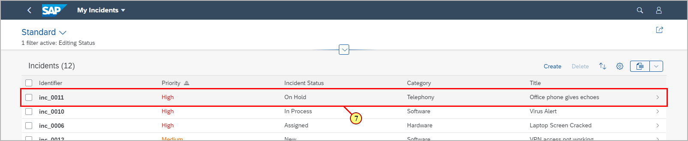

(8) The page is shown in flexible column layout.\
Select another List Report line item in order to display its details in the object page.

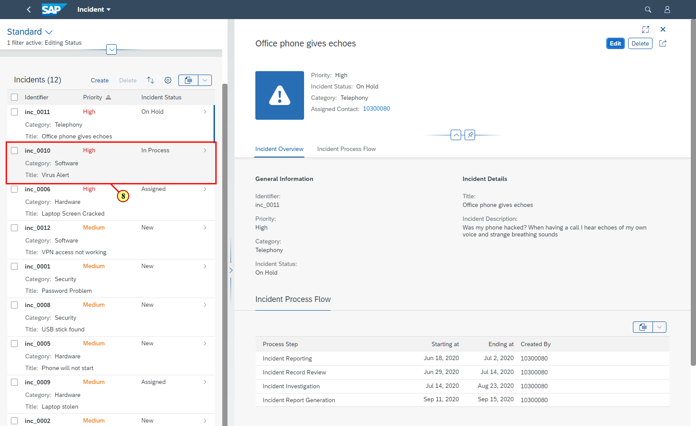

(9) In the top right corner of the object page, click the toggle to fullscreen icon 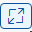.

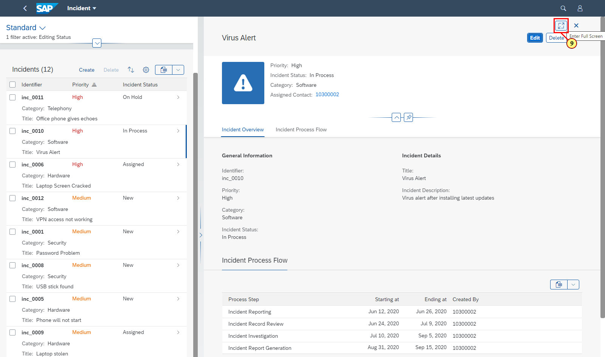

The List Report column is closed, and the object page is shown full screen.

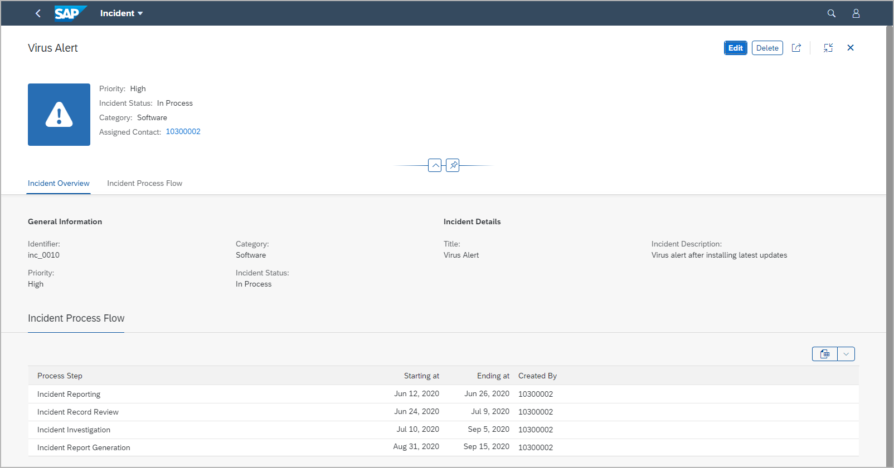

You can toggle back to split layout by clicking the same icon again.

## Summary

You've now enabled flexible column layout (FCL) for the app. FCL is supported for up to 2 navigation levels, splitting the screen into three areas.

Continue to - [Exercise 3 - Configuring the app ](../ex3/README.md)