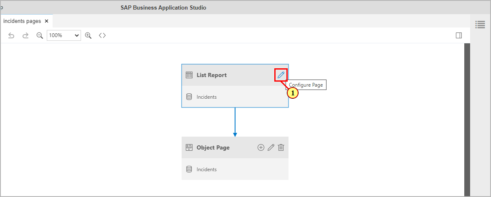
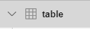
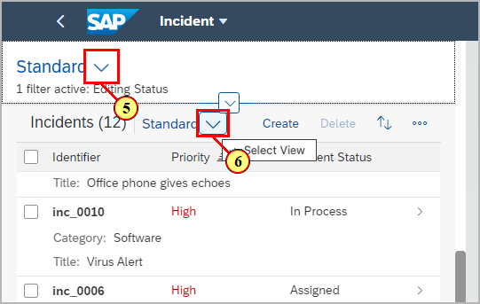
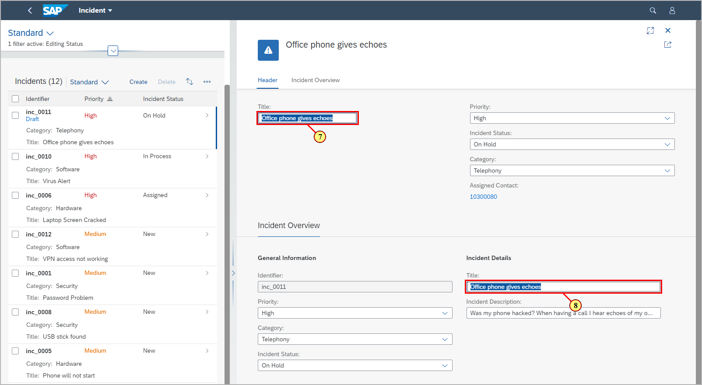
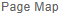
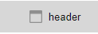
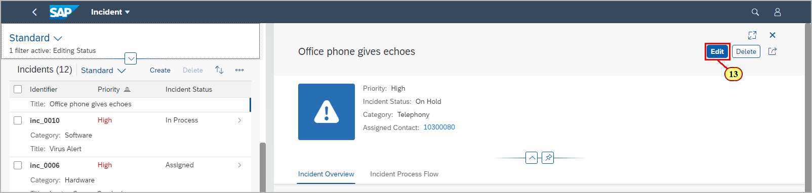
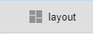
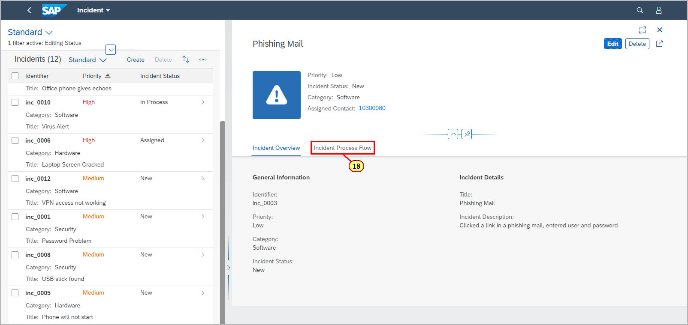

# Exercise 3 - Configuring the App

In this exercise, we will configure the behaviour of the app using the SAP Fiori Page Map.

## Exercise 3.1 Enable Data Load During Start of the App

When starting the app, per default the user has to press the
**Go** button in order to trigger the selection.\
This allows defining filters before the query is executed.\
The default behaviour can be changed in a way that selection is immediately
triggered when the app is started.

In the SAP Business Application Studio, open the SAP Fiori Page Map (via Context Menu on the folder **app** or via **View -> Command Palette...**)

(1) On the tile **List Report**, click icon **Configure
Page**

.

(2) In the page editor, click
.

(3) In the drop down box **Initial Load**, select
**True**.\
The configuration is automatically saved.

Navigate back to the Fiori launch
page and refresh the browser.
Data will now be immediately loaded in the list report page when starting the app.

## Exercise 3.2 Enable Control Level Variant Management

The List Report pages offers per default page variant management.\
With it, all personalizations of visible selection fields and table columns can be
saved as a presentation variant.\
With the Page Map, you can switch to control level variant management.
This allows separate management of filter and table variants on the List Report page.\
(4) In the Page Editor properties for table view, open drop down box **Variant Management** and select **Control**.

Refresh the preview browser tab. You now can manage the filter (5) and table variants (6) separately.

## Exercise 3.3 Configure Editable Object Page Header

When in edit mode, header fields are per default shown as editable
input fields.\
This might not be wanted in case these fields are additionally displayed in another section of the object page (7)(8).

In order to prevent that, you can set the header to display only during editing.\
Switch back to Business Application Studio.\
(9) Click  icon to get back to the Page Map overview.

(10) In the Page Map overview, on the tile **Object Page** click the **Configure
Page** icon

(11) Click  to display the object page header configuration properties.

(12) Open drop down box **Editable Header Content** and
set to **False**.

(13) Switch back to the preview browser tab.\
In case the UI was in edit mode from the previous exercise, navigate back to the Fiori Launch Page and refresh the browser.
In the object page, click 

(14) The header area now stays in display mode when the object page is in edit mode.

(15) Click to switch back to display mode.

## Exercise 3.4 Tab Based Section Layout

Per default, all the sections in the object page are displayed one
below the other.

You can configure to have them displayed in separate tabs.

Go back to Business Application Studio.

(16) In the Page Editor of the object page, click

(17) In the drop down box for **Section Layout**, select **Tabs**

(18) Refresh the app preview browser tab. Each object page section is
now displayed in a separate tab.

Tab based layout helps to reduce the need for scrolling the page in case of many object page sections.\
In the sample scenario there are currently only 2 content sections, so you can switch back to page based section layout.

## Summary

By using the SAP Fiori Page Map, you've now configured initial load during app start, editable header content, control level variant management and tab based section layout.

Continue to - [Exercise 4 - Adding a Custom Page](../ex4/README.md)
