# Exercise 4 - Adding a Custom Page

In this exercise, we will add a custom page to the app.

## Exercise 4.1 Copy Over the Sample Custom Page

With the SAP Fiori tool **Page Map**, you can add additional Object Pages and custom pages to your app.\
For custom pages, you have the option of having new custom view controller artifacts generated,\
or, as we will do in this exercise, integrate an existing custom view in the navigation flow.\
For this, we will copy the sample artifacts to the webapp folder of the app.

(1) In the project explorer, expand folder paths **app/incidents** and **app/test-resources**.\
In the folder **app/test-resources**, click and hold folder .

(2) Drag & Drop the folder over to **app/incidents/webapp**.\
Alternatively, you can use the context menu to copy and paste the folder.

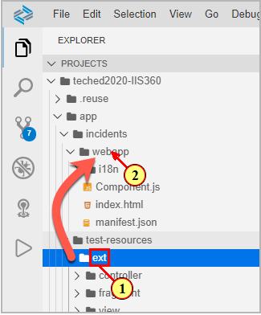

## Exercise 4.2 Adding a Custom Page via SAP Fiori Page Map

In SAP Business Application Studio, open the SAP Fiori page map (via Context Menu on the folder **app** or via **View -> Command Palette...**)\
(3) Click on the icon **Add New Page**.

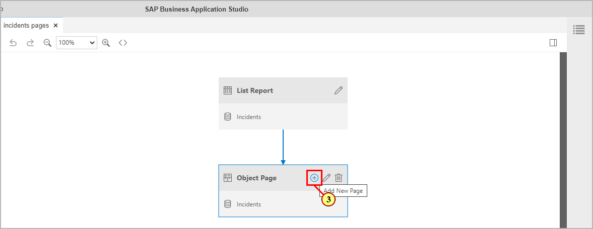

Open the dropdown list **Select Page Type**.\
(5) Select entry .

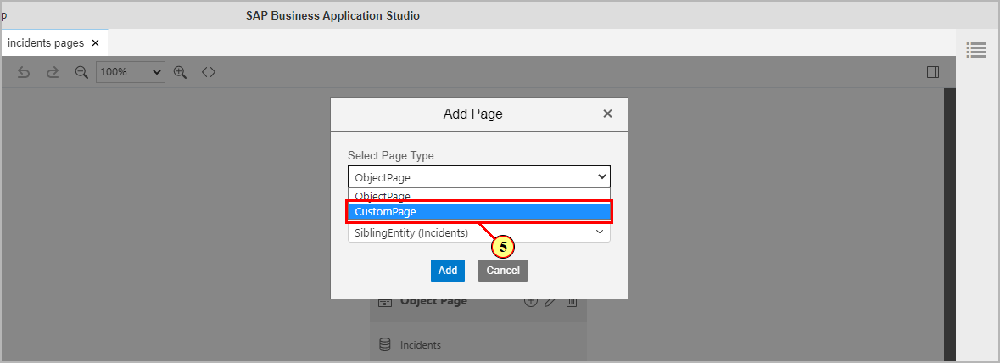

(6) We want to navigate to the custom page from the table **Incident Flow** shown on the Object Page.\
 Open the **Navigation** dropdown list.
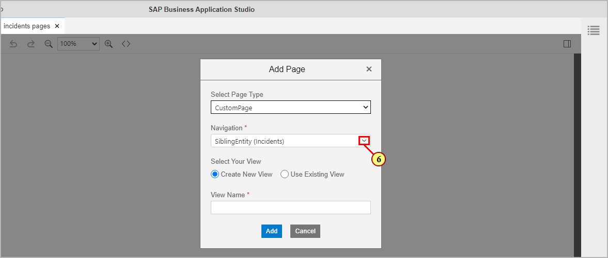

(7) Select entry .

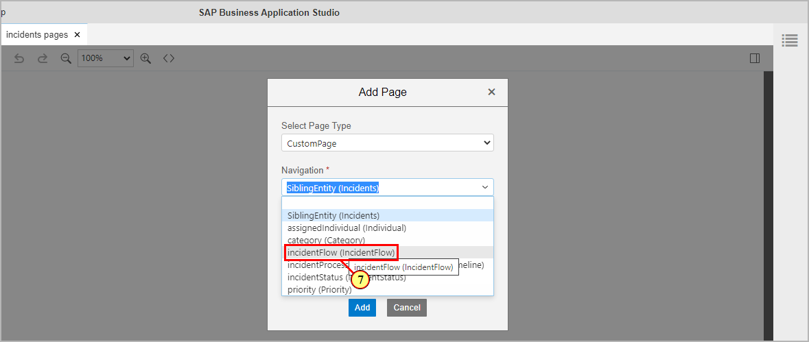

(8) As we want to use the prepared sample custom view, select radio button **Use Existing View**.

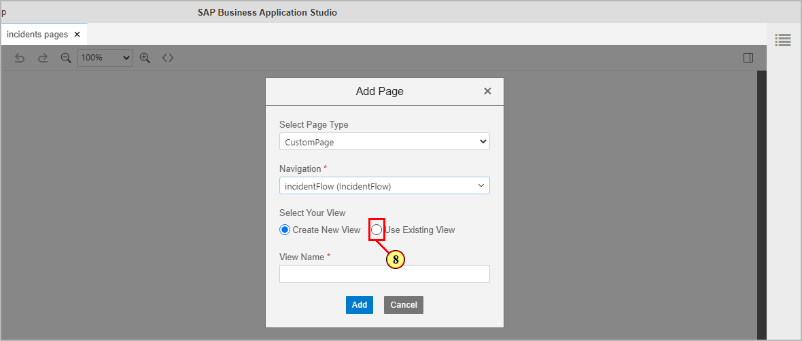

(9) In the dropdown **View Name**, the custom view **ProcessFlow** is automatically preselected.

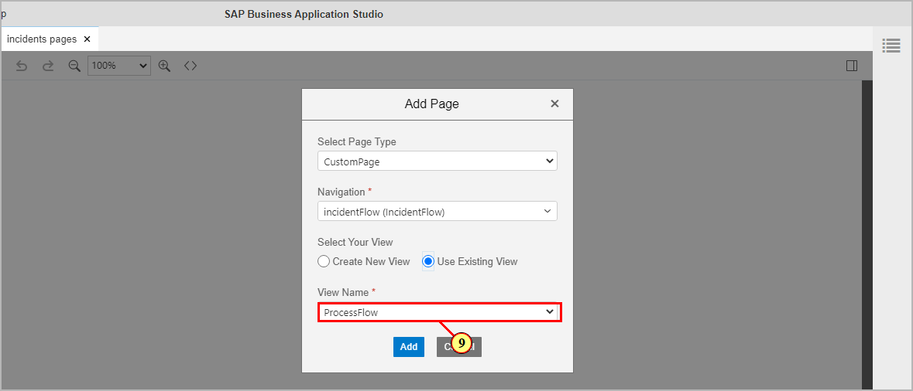

(10) Click button .

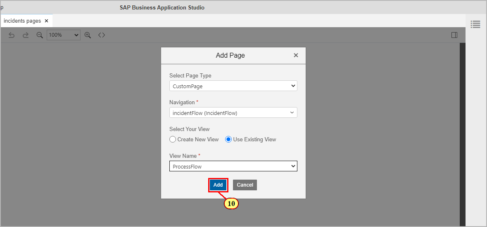

(11) A success message toast  is shown.\
(12) The Page Map now shows an additional page node below the object
page.

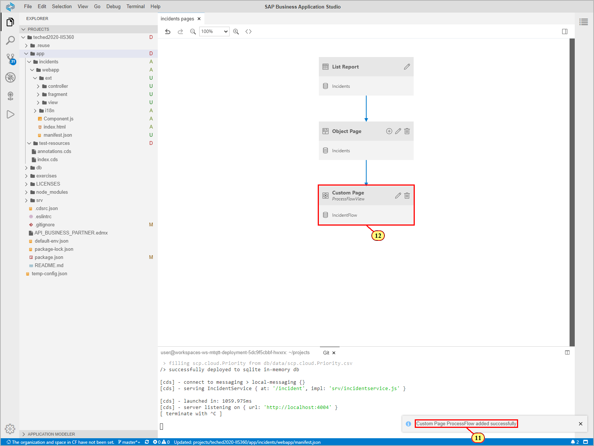

## Exercise 4.3 Custom Page: Testing the App

Switch to the preview browser tab and refresh.\
(13) Click on a list item in the table **Incident Process Flow**.

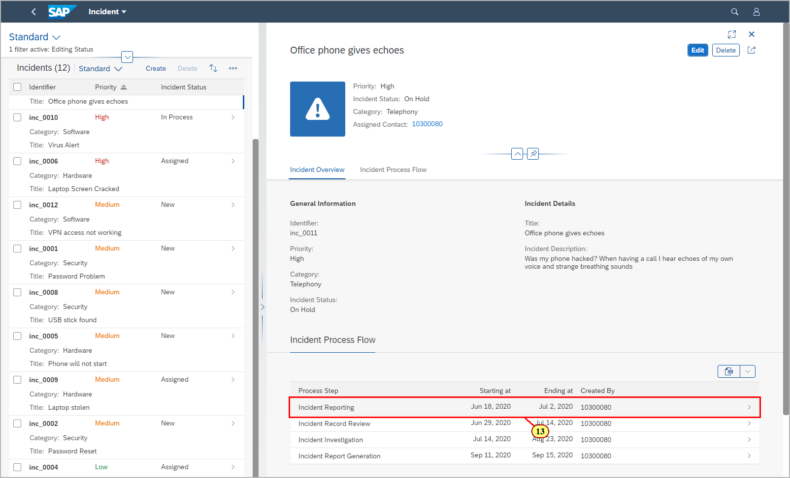

The custom page is opened to the right.\
(14) To expand the view, click on the icon **Expand the last column** .

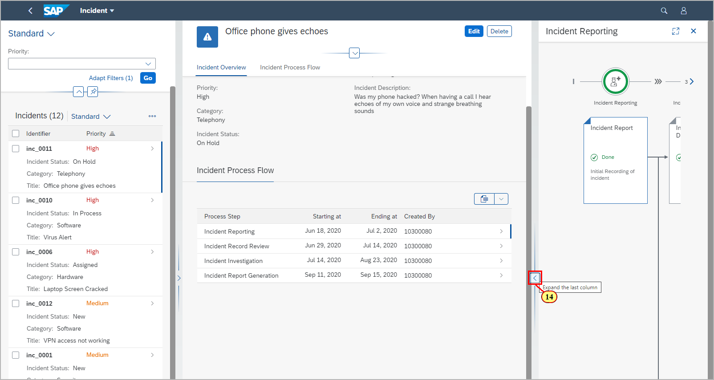

The right page column is expanded. \
(15) The custom page title shows the process step title from the selected item of table Incident Process Flow via context model binding.\
(16) As the Object Page, the custom page offers the expand/collapse buttons for the flexible column layout.

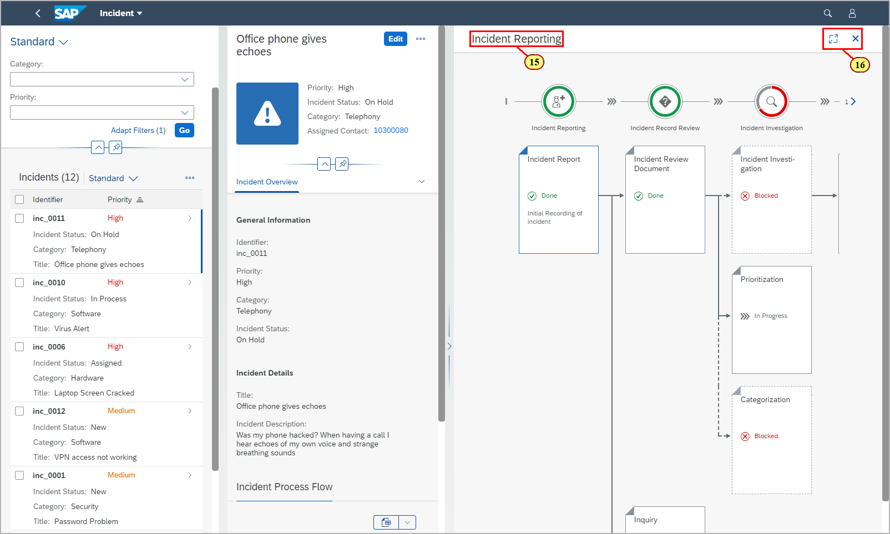

## Summary

You've now successfully added a custom page by using the Page Map.

Continue to - [Exercise 5 - Adding a Custom Section ](../ex5/README.md)
