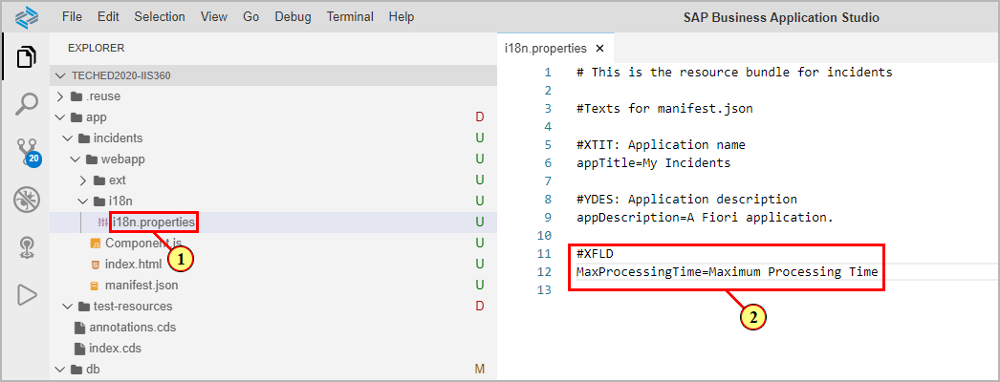
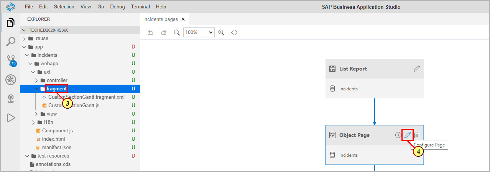
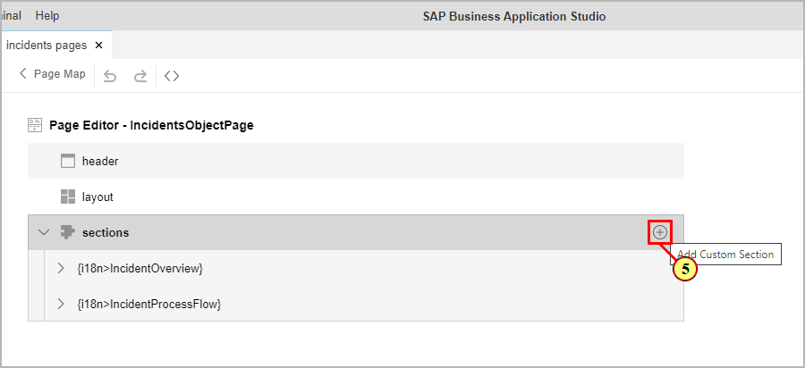
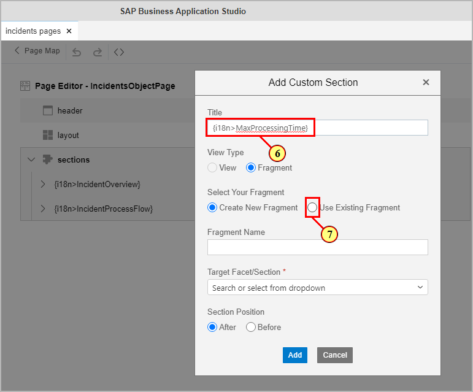
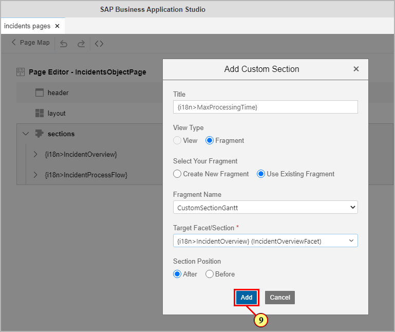
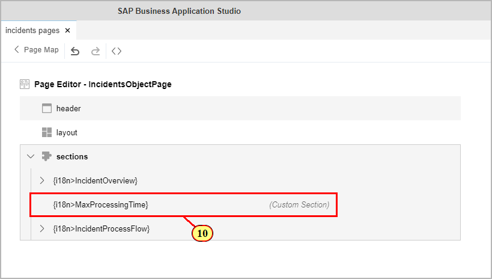
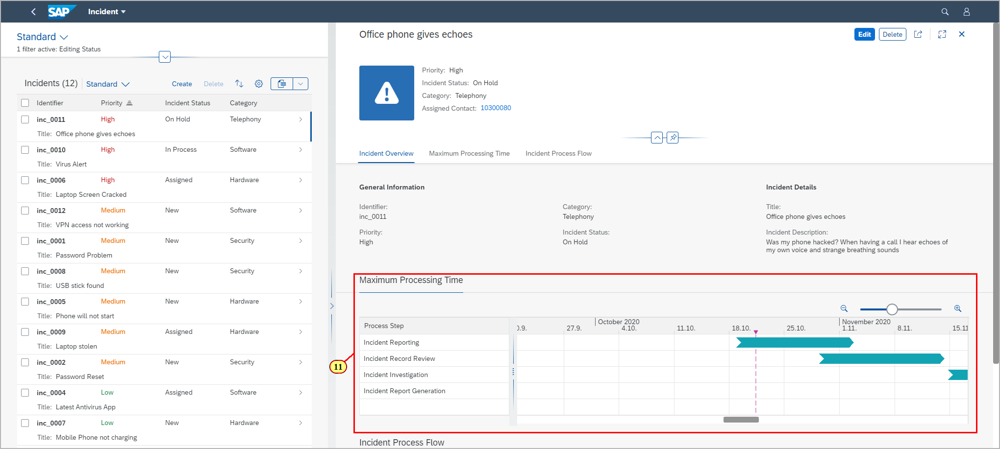

# Exercise 5 - Adding a Custom Section

In this exercise, we will add a custom section to the object page by using the SAP Fiori Page Map.

## Custom Sections Overview

Custom sections offer the possibility of enhancing the object page with a freestyle UI5 XML fragment.\
The object page provides its current model context to the custom section, allowing displaying data from the UI5 OData model via context binding.\

## Exercise 5.1.1 Enhancing the language model

For the title of custom sections to be shown on the object page, we want to use a property from the language model of the app.\
(1) Open file **app/incidents/webapp/i18n/i18n.properties**\
(2) Enter the following new property:

```js
#XFLD
MaxProcessingTime=Maximum Processing Time
```



Save changes (**File->Save**).

## Exercise 5.1.2 Add a custom section via Page Map

(3) The sample scenario provides a prepared XML fragment in the folder **app/incidents/webapp/ext/fragment**,\
along with a javaScript file where you can implement event handler functions.

In the SAP Business Application Studio, open the page map (via Context Menu on the folder **app** or via **View -> Command Palette...**)\
(4) On the page map tile **Object Page**, click icon  (**Configure Page**.).\


(5) In the Page Editor, click icon (**Add Custom Section**) in the top right corner of area **sections**.



(6) In the dialog **Add Custom Section**, enter into the field **Title** the language property added in [step 5.1.1](#exercise-511-enhancing-the-language-model) in the following format:

```js
{i18n>MaxProcessingTime}
```

(7) Click radio button **Use Existing Fragment**

.

(8) Open the drop down **Target Facet/Section** and select **IncidentOverViewFacet**.\
In combination with the **Section Position** (we leave it to **After**), you define where the custom section should be located\
on the object page.

(9) Click button 



(10) The page editor now shows an additional section.



(11) Switch to the preview browser tab and refresh. The custom section is shown.\
Selecting another list item in the List Report changes the object pages context binding and with it also the data shown in the Gantt chart.



## Summary

You've now added a custom section to the object page based on an XML fragment.

Continue to - [Exercise 6 - Enhance the UI with annotations ](../ex6/README.md)
