# Exercise 6 - Enhance the UI with annotations

In this exercise, we will enhance the UI by adding annotations. For each exercise, you will make usage of the CDS compilers
LSP support for annotation modelling. Alternatively, you can apply prepared code snippets.

## Exercise 6.1 Adding a field group

After completing these steps you will have added a new content section to the object page.\
You will use annotation **FieldGroup** which represents a collection of different types of data fields.\
The field group annotation definition with the link to the different data field representation options can be found [here](https://github.com/SAP/odata-vocabularies/blob/master/vocabularies/UI.md#FieldGroupType).

(1) In BAS Explorer, open file **app/annotations.cds**.

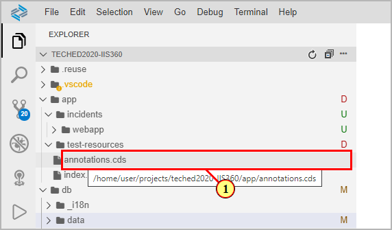

(2) Place cursor in the section **'field group enhancement'**

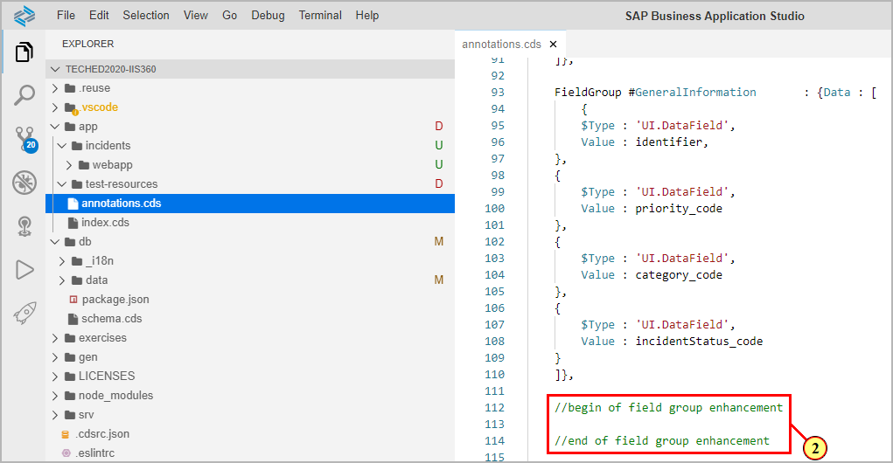

Trigger the LSP support for annotation modelling by pressing keys **ctrl+space**.\
Filter the available menu entries by typing **field**.\
(3) In the popup menu, select **FieldGroup**.

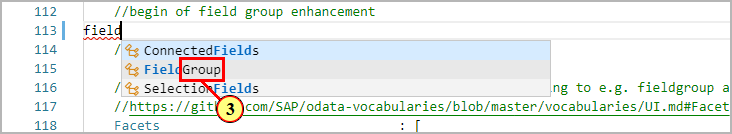

The annotation is added along with its basic structural elements. The cursor is placed between 'FieldGroup' and ':' .\
Here you add a qualifier for the annotation which you later can refer to.\
(4)Type **#Admin** as qualifier.

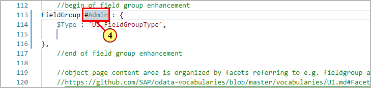

Press tab to move cursor inside the curly brackets.\
Trigger LSP support (ctrl+space).\
(5)  Select **Property "Data"**.\ 

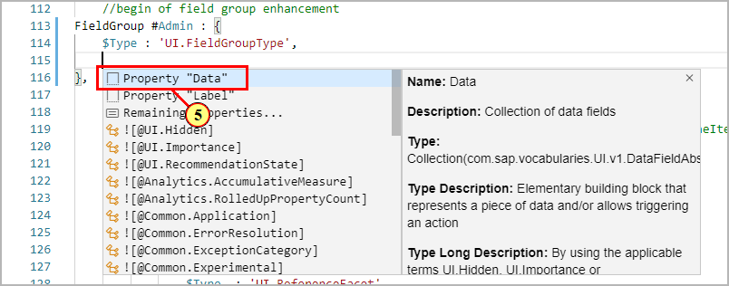

The cursor is moved inside the collection brackets [].\
Trigger again LSP support (ctrl+ space).\
(6) Start typing in **datafield** to filter the list. Select **Record "DataField"**.

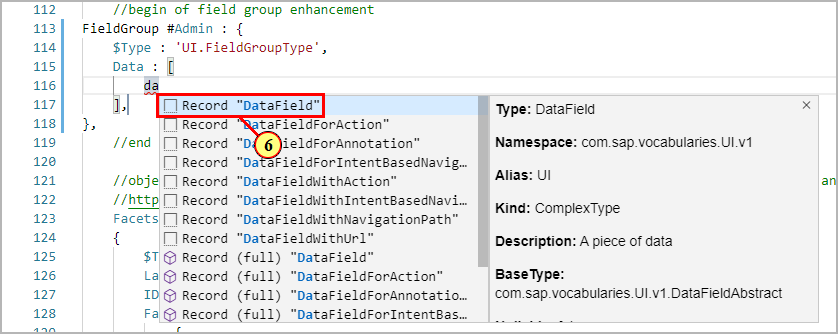

DataField record is added along with its required value, the cursor is placed inside the record {} after property **Value : **.\
Trigger again LSP support.\
Start typing in **created** to filter the list.\ 
(7) Select property .

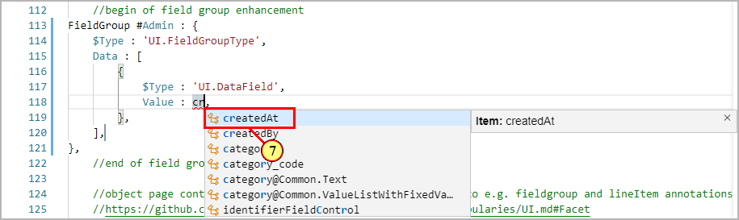

(8) Place the cursor after the comma of record {}, and add additional DataField record with Value **'createdBy'** in the same way

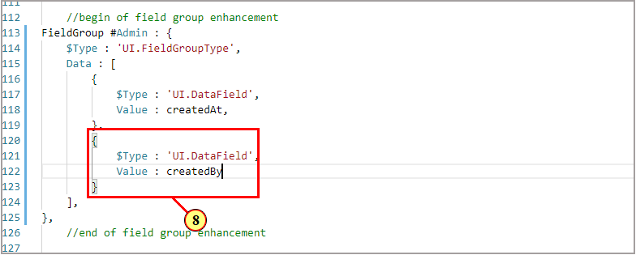

The full annotation:

```js
FieldGroup #Admin: {
    $Type:'UI.FieldGroupType',
    Data : [
        {
            $Type:'UI.DataField',
            Value : createdAt,
        },
        {
            $Type:'UI.DataField',
            Value : createdBy
        },
        ]
},
```

## Exercise 6.2 Add a reference facet annotation

The different sections of the object pages content area are defined by so called **reference facet** annotations.\
You can group several reference facets in so called **collection facet** annotations.\
You will now add the field group **#Admin** you just created by referring to in a new reference facet inside the  collection facet **IncidentOverviewFacet**.

(9) Place cursor in the section **'reference facet enhancement'**

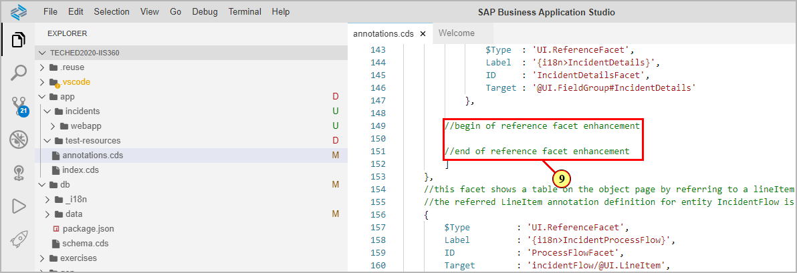

(10) Trigger LSP support (ctrl+space) and select 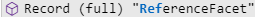.

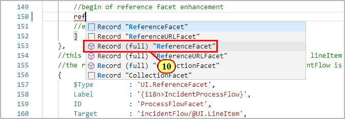

The annotation is added along with its basic structural elements.\ 
(11) For property **'Target'**, place cursor inside quotes ' ' and trigger LSP support (ctrl+space).

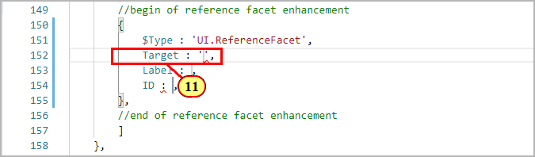

(12) Select .


Press **Tab** key to move cursor to the Label property.\
(13) Type in **'{i18n\>AdminData}'** in quotes. This refers to a property defined in the language model definition file (db/_i18n/i18n.properties). Hovering the mouse over the value gives a preview of the underlying text.


Press **Tab** key to move cursor to ID property.\
(14) Type **'AdminDataFacet'** in quotes. Save changes.

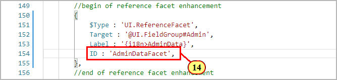

The full annotation:
```js
            {
                $Type  : 'UI.ReferenceFacet',
                Target : '@UI.FieldGroup#Admin',
                Label  : '{i18n>AdminData}',
                ID     : 'AdminDataFacet'
            }
```

Make sure that the service is running (Terminal command **cds w**).\
Switch to the preview browser tab and refresh.\
(15) On the object page, new section **'Admin Data'** is shown inside the collection facet **Incident Overview**.

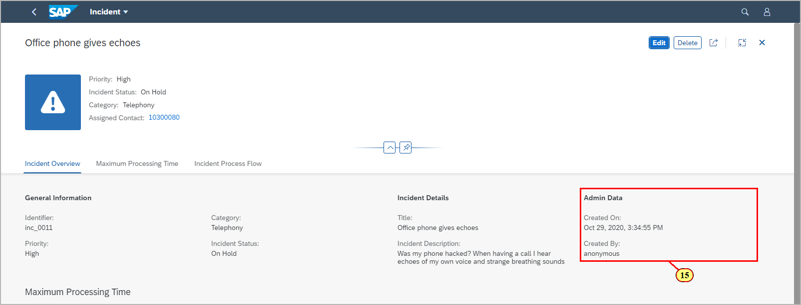

## Exercise 6.3 Add a new table column with criticality highlighting

In this exercise, you will add an additional column to table **Incident Flow** shown on the object page.\
Tables are defined by a so called **lineItem annotation**, representing a collection of different kinds of data field annotations.\
Each data field annotation refers to a property of the annotated service entity, representing a piece of data.\
An overview of the different data representation options can be found [here](https://github.com/SAP/odata-vocabularies/blob/master/vocabularies/UI.md#DataFieldAbstract).\
You can now enhance the existing lineItem annotation for entity **IncidentFlow** by adding an additional data field annotation.

(16) Open file **app/annotations.cds**.\
Place cursor in section **'column enhancement'**

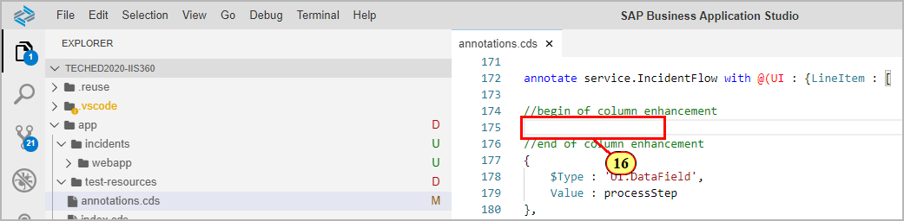

Trigger LSP support (**ctrl+space**).\
(17)  Choose .

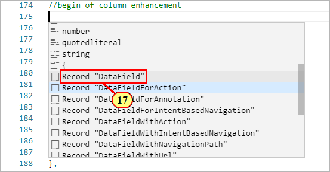

The annotation is added along with its basic structural elements.\
With the cursor sitting behind **Value :**, trigger LSP support.\
(18)Choose.

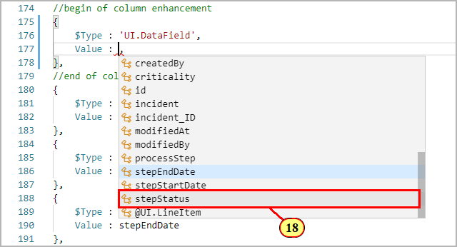

For highlighting of table column values, we now add property **Criticality**.\
As value we point it to a corresponding property of entity **IncidentFlow** representing the criticality of each entity instance as a number.\
Add an empty line after **Value : stepStatus,**\
Trigger LSP support (ctrl+space).\
(19)Choose 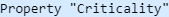.

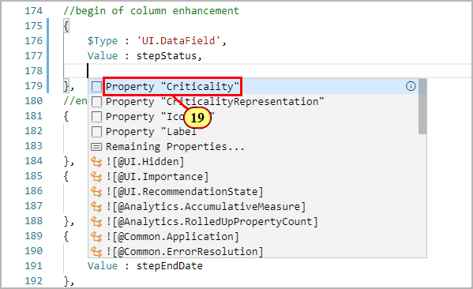

Trigger again LSP support.\
(20) Choose entity property **'criticality'**.

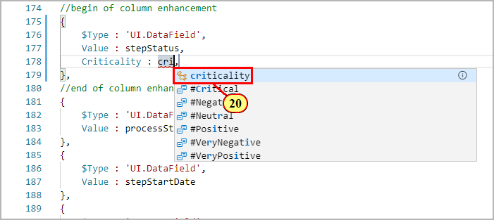

Save changes.
The full annotation:
```js
{
    $Type : 'UI.DataField',
    Value : stepStatus,
    Criticality : criticality
},
```

Switch to the preview browser tab and refresh.\
(21) On the object page, A new column **Process Step Status** is shown
in the table **Incident Process Flow**

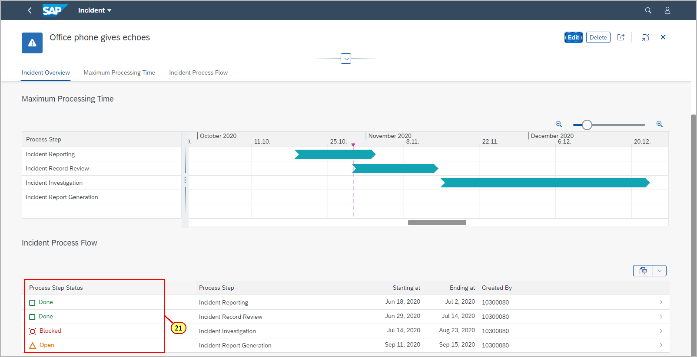

## Summary

You've now used the LSP annotation support and added annotations for
**UI.FieldGroup**, **UI.ReferenceFacet** and **UI.DataField**.

Continue to - [Exercise 7 - Adding a contact card showing data from SAP S/4 HANA ](../ex7/README.md)