# Exercise 7 - Adding a contact card showing data from SAP S/4 HANA

In this exercise, you extend the sample service with the consumption of an external Business Partner service.<br>
First, you will work with local mock data and later on get the data directly from the external SAP S/4HANA cloud system.<br>
The data will be visualized in the object pages header as a contact card.

## Exercise 7.1 Get the Business Partner EDMX file

You will now download the Business Partner EDMX specification from SAP API Hub and import it into the sample service.\
Open the [SAP API Business Hub page](https://api.sap.com/api/API_BUSINESS_PARTNER/resource?tag=Business%20Partner) in your browser.

(1) Choose the **Details** tab\
(2) Click button **Download API Specification** and select .\
If required, log on.
In case you don't have credentials, or have problems downloading the file, you can also find the file API_BUSINESS_PARTNER.edmx within project folder app/test-resources/api-hub.\
If you’re using Chrome as a browser, you now see the downloaded file in the footer bar.\

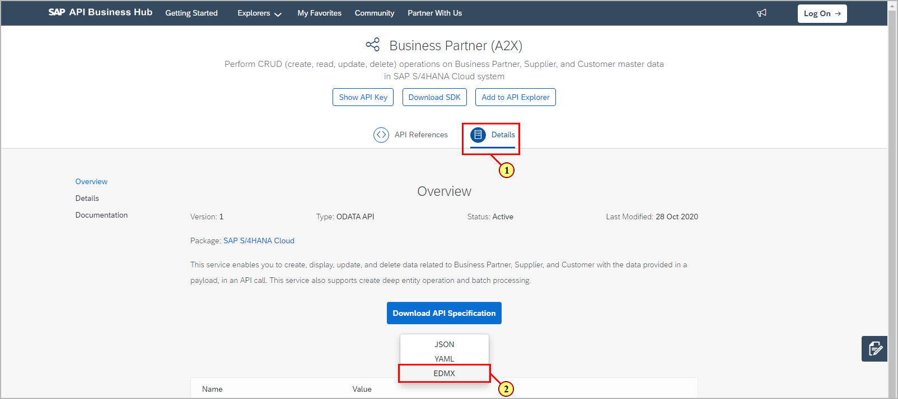

## Exercise 7.2 Add the EDMX File and local data to your project

In this exercise, you will import the downloaded EDMX specification into the sample service.
By providing mock data, you will be able to develop and test the imported entities without the need of having S/4 HANA backend connectivity in place.

If not already running, start the OData service in a terminal session with **cds watch**.\
Drag the API_BUSINESS_PARTNER.edmx file from your browser's download area/folder onto your BAS workplace and drop it into folder **srv**.

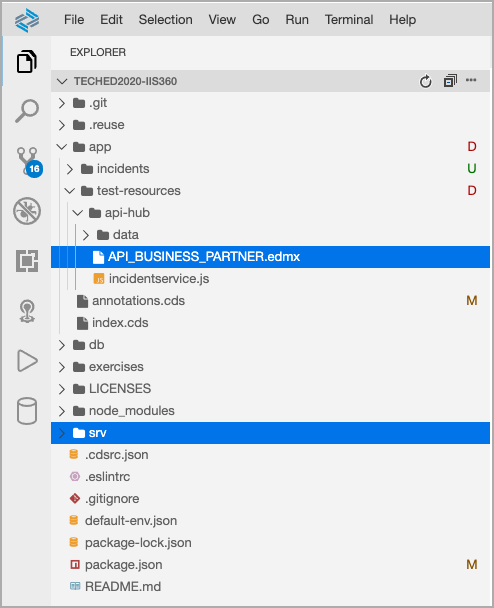

The application programming model will automatically create a new folder  **srv/external** and generate a new file API_BUSINESS_PARTNER.csn in it, which is a compact representation of CDS.\
If the folder is not automatically generated, run the following command in your terminal session from the projects root folder:\
**cds import srv/API_BUSINESS_PARTNER.edmx**

In the BAS project explorer, open file **srv/incidentservice.cds**.\
(3) Add the following code in line 2:
```js
using {API_BUSINESS_PARTNER as external} from '../srv/external/API_BUSINESS_PARTNER.csn';
```

In the same file, scroll down to **//Expose additional entities**.\
(4) Enter the following code below:
```js
@readonly
entity BusinessPartner         as projection on external.A_BusinessPartner {
    key BusinessPartner, BusinessPartnerFullName
};
@readonly
entity BusinessPartnerAddress  as projection on external.A_BusinessPartnerAddress {
    key BusinessPartner, key AddressID, CityName, Country, PostalCode, StreetName, HouseNumber
};
```
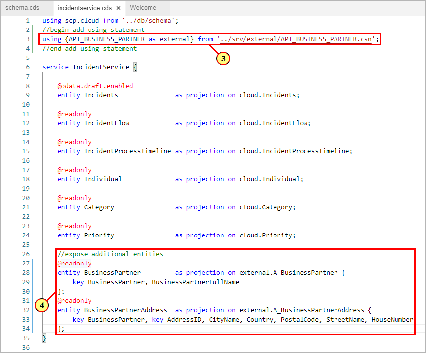

By adding the using statement (3), a new service is exposed with a definition based on the original edmx file. Furthermore, you have extended the Incidents service by adding two projected entities from the Business Partner API (4).\
Since there is no backend connectivity in place yet, you will start with using local data first.

In BAS project explorer, open folder **app/test-resources/api-hub/data**.\
(5) Select the following two CSV files, drag and drop them to folder **db/data**.

- API_BUSINESS_PARTNER-A_BusinessPartner.csv
- API_BUSINESS_PARTNER-A_BusinessPartnerAddress.csv

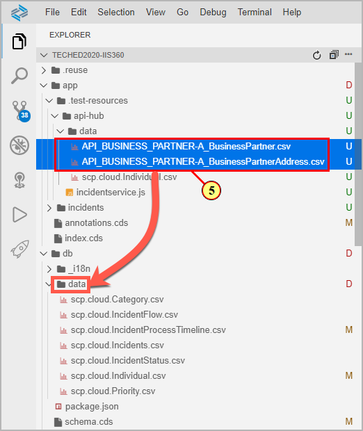

(6) In the preview browser tab, click on one of the marked entities to show mock data.
Note that only the fields show data where mock data has been provided
for.

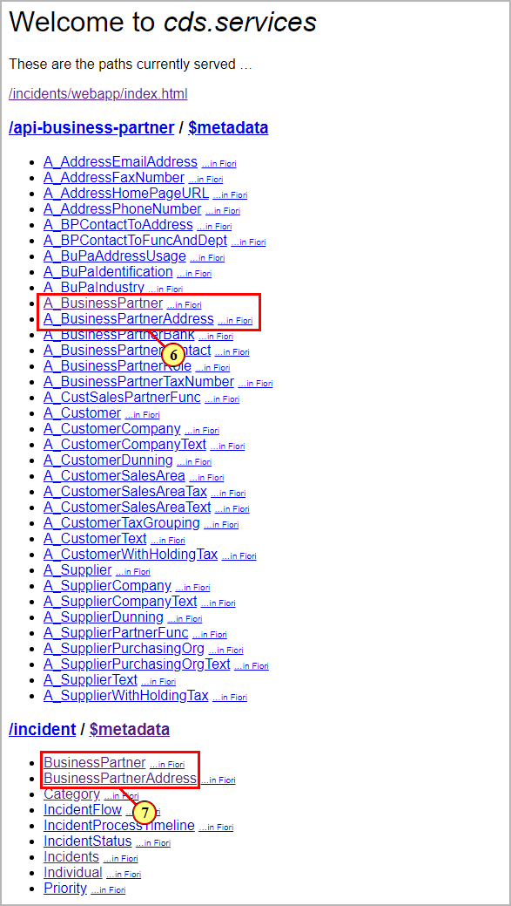

(7) Clicking on the new entities of the Incidents service shows mock
data for the projected entity fields only.

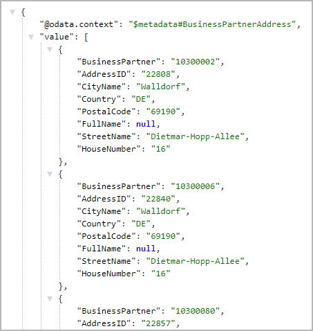

## Exercise 7.3 Add associations to Incidents Service entities

In this exercise, you will add additional properties to entity **Individual** and associations to the Business Partner Service entities.

In the BAS project explorer, open file **db/schema.cds**.\
(8) Scroll to the entity definition **Individual** and add the two additional properties
```js
businessPartnerID : String;
addressID : String;
```

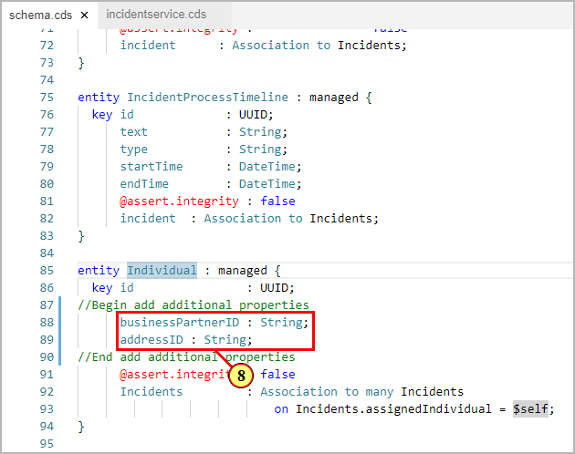

For the additional properties, you require additional mock data.\
In BAS project explorer, open folder **app/test-resources/api-hub/data**.\
(9) Select the remaining CSV file scp.cloud.Individual.csv.\
(10) Drag and drop to folder **db/data**.

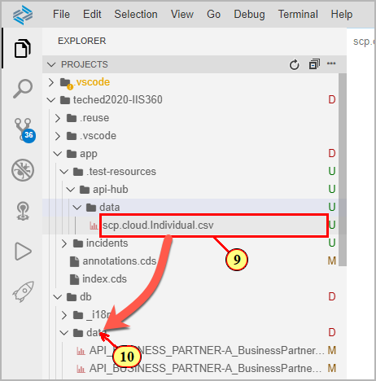

(11) Click  to confirm replacement of the existing csv file.

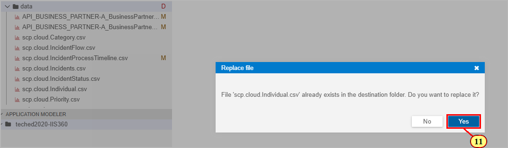

(12) In your browser preview tab, select entity .

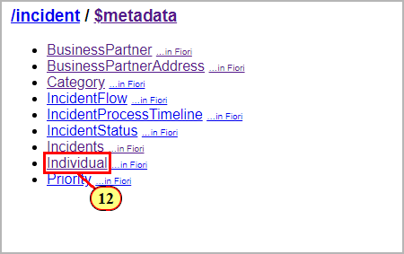

(13) Mock data for the additional properties are shown.

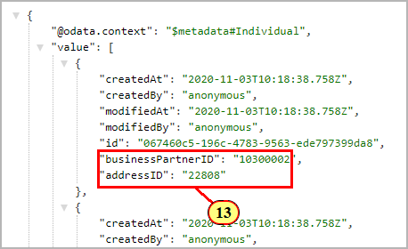

In order to incorporate the external services data into the service model,\
you will now add some associations.\
In BAS Explorer, open file **db/schema.cds**.
(14) Add the following code in line 2:

```js
using {API_BUSINESS_PARTNER as external} from '../srv/external/API_BUSINESS_PARTNER.csn';
```

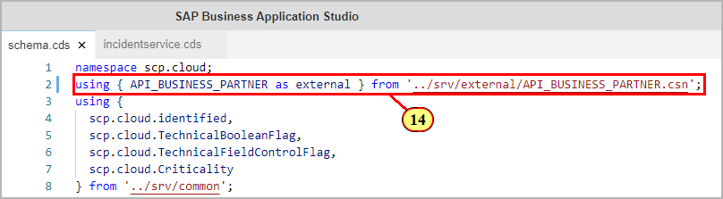

Scroll down to section **//add associations to external entities** at the end of the file\
(15) Add the following code:

```js
extend scp.cloud.Individual with {
  businessPartner        : Association to one external.A_BusinessPartner
  on businessPartner.BusinessPartner = businessPartnerID;
  businessPartnerAddress : Association to one external.A_BusinessPartnerAddress
  on  businessPartnerAddress.BusinessPartner = businessPartnerID
  and businessPartnerAddress.AddressID       = addressID;
    }
```

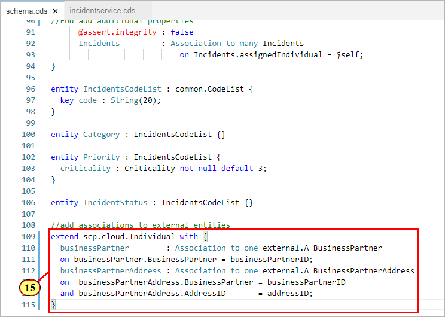

Note that the mock data that was added in step (11) for entity scp.cloud.Individual properties **businessPartnerID** and **addressID** need to match existing business partner address data keys in your S/4 HANA cloud system when later switching from mock data to real S/4 HANA Cloud connectivity.

You can test the new associations in the preview browser tab.
Select entity **Individual** and add the following to the browser Url

```js
(id=067460c5-196c-4783-9563-ede797399da8)?$expand=businessPartnerAddress
```

This will show the business partner address data inline with the Individual data.

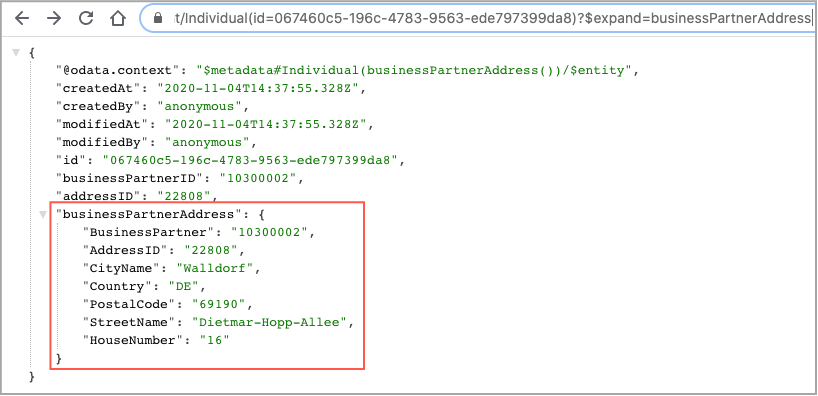

## Exercise 7.4 Add annotation for contact card

In this exercise you will add an annotation of type **@Communication.Contact** with properties referring to the new external entities, and enhance the object page header to show a contact card link.

In BAS project explorer, open file **srv/common.cds**.\
(16) Add the following code to the end of the files content:
```js
annotate service.Individual with @(Communication.Contact : {
      fn   : businessPartner.BusinessPartnerFullName,
        adr   : [{
            type     : #work,
            code     : businessPartnerAddress.PostalCode,
            street   : businessPartnerAddress.StreetName,
            building : businessPartnerAddress.HouseNumber,
            country  : businessPartnerAddress.Country,
            locality : businessPartnerAddress.CityName
        }]
})
;
```

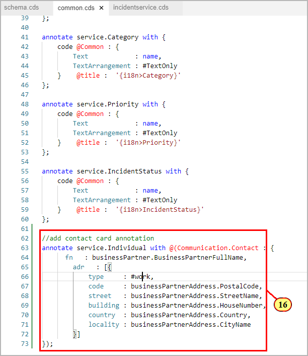

To visualize the contact card in the object pages header, you need to add an additional annotation.\
Open file **app/annotation.cds**.\
Locate section **header facet enhancement**.\
(17) Enter the following code:

```js
    {
        $Type : 'UI.ReferenceFacet',
        Label : '{i18n>AssignedContact}',
        Target : 'assignedIndividual/@Communication.Contact',
    }
```

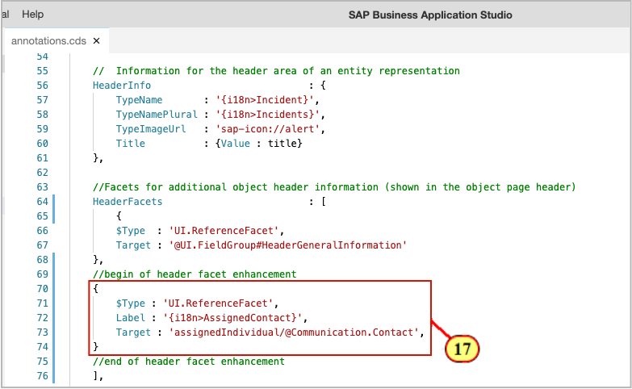

(18) Go to the preview browser tab and refresh. The Object Page header shows a contact card link.

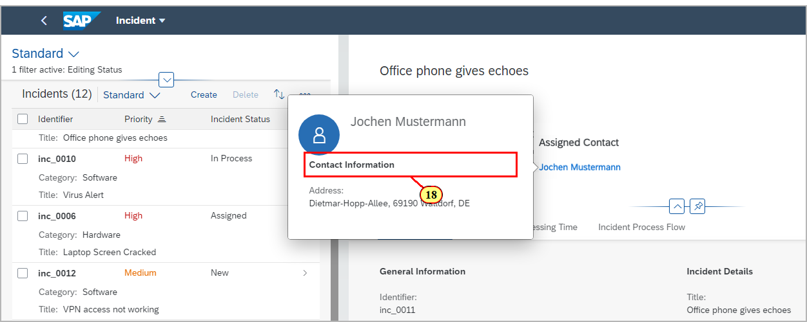

## Exercise 7.4 Fetch business partner data from S/4 HANA Cloud system

In order to consume data from an S/4 HANA Cloud system in a local setup, you need to add the VCAP_SERVICE credentials to the default-env.json file located in the root folder of this project.
The file has been prepared for basic authentication so that you just have to enter user and password, and complete the OData URL to the S/4 HANA cloud instance.\
Some further notes: in a deployment scenario, you would create a destination service and bind it to your application in order to have the VCAP_SERVICE credentials.
Details about creating a destination in SAP Cloud Platform can be found [here](https://help.sap.com/viewer/92204dcdf722491883c7819f66a70de8/latest/en-US/e08040a9cf664555957a419dc2df0e19.html).\
Then you can configure the external service in the package.json file using [this guide](https://cap.cloud.sap/docs/guides/consuming-services#configuring-required-services).

In this exercise, you will add custom handler code which is called on the READ event of the BusinessPartner and BusinessPartnerAddress entities. Whenever an OData call for business partner data issued from the UI, this handler is called. For further details about the currently supported query capabilities, please refer to the [SAP Cloud Application Programming Model documentation](https://cap.cloud.sap/docs/guides/consuming-services#sending-requests).

In BAS project explorer, open folder **app/test-resources/api-hub**.\
(19) Drag file .\
(20) Drop on folder **srv**.

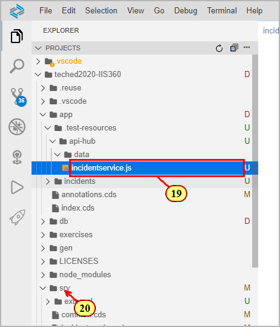

(21) Click  to confirm that the existing file is overwritten.

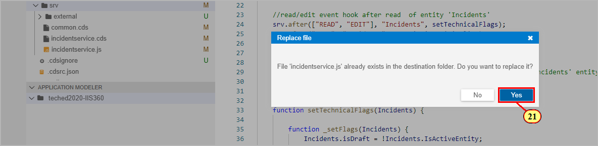

Open file package.json and scroll down to section **"cds"**
(22) Remove hyphens from properties **model** and **credentials** to enable the external service configuration.\
More details abound external services configuration can be found [here](https://cap.cloud.sap/docs/guides/services#rest-and-odata).

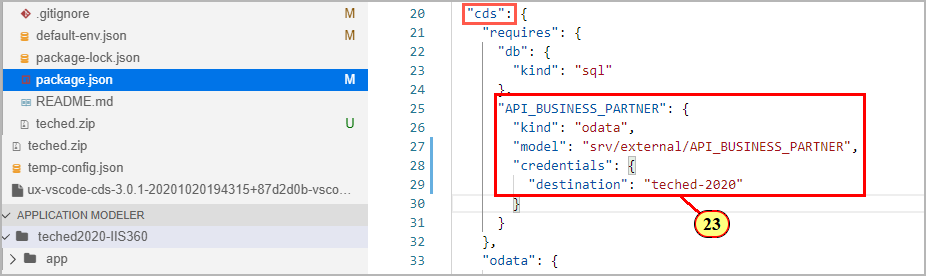

(23) On your preview browser tab, select entity **BusinessPartnerAddress.**

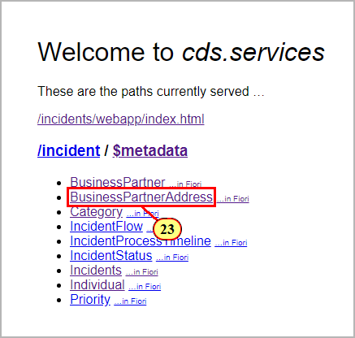

The OData response will now show data retrieved from the S/4 HANA system.

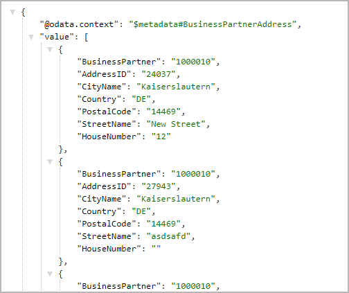

(24) In your preview browser, open the app and navigate to the object page.\
The contact card now shows data from S/4 HANA.

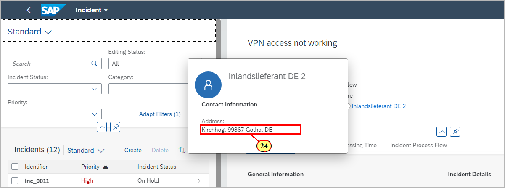

## Summary

You've now successfully completed the hands-on workshop. Congratulations!
